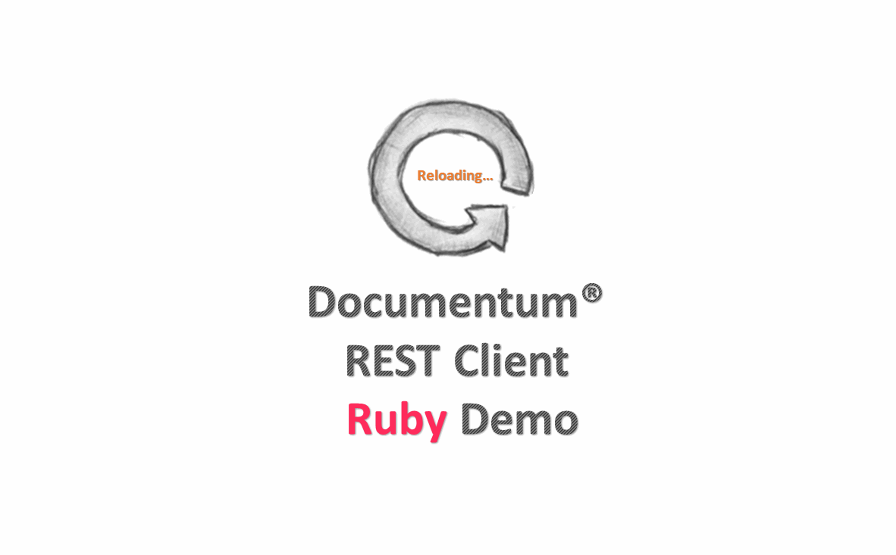

# documentum-rest-client-ruby
[](http://www.apache.org/licenses/LICENSE-2.0)

Reference implementation of a Ruby client for accessing Documentum REST Services

## What the demo demonstrates?
It will do the following jobs for some REST resources.
```
0. User CRUD
1. GET Groups
2. Simple Search
3. Cabinet CRUD
4. Folder/Document CRUD
5. SysObject Move/Link/Copy
6. SysObject Check Out/In
7. Get CheckedOut Objects
```

## Requirements

1. Ruby 2.1.5+ suggested, earlier Ruby versions such as 1.8.x, and 1.9.x are no longer supported officially. Version 2.3.1 is used in this demo.
2. Rails 4.2.3+ suggested, a full stack framework for web application development. It's required for demo. 
3. An instance of *Documentum REST Services 7.2* is available.


## Instructions  
These following steps will direct you to how to run this demo from the scratch, including preparing the Ruby environment, building this project and starting the demo.

*Note*: below instructions are implemented only on Linux, and this demo has been tested on Ubuntu 14.04 at the time of writing this page. 

1. Install some dependencies for Ruby
    
    ```
    $ sudo apt-get update
    $ sudo apt-get install git-core curl zlib1g-dev build-essential libssl-dev libreadline-dev libyaml-dev libsqlite3-dev sqlite3 libxml2-dev libxslt1-dev libcurl4-openssl-dev python-software-properties libffi-dev nodejs
    ```
    
2.  Download Ruby source code from [Ruby 2.x](https://www.ruby-lang.org/en/downloads/) and install it.
   
   ```
    $ cd ruby-2.x
    $ ./configure
    $ make
    $ sudo make install
    $ sudo gem install bundler
    ```
    
3. Clone source code of this project from [Github](https://github.com/Enterprise-Content-Management/documentum-rest-client-ruby.git)
    
    ```
    $ git clone https://github.com/Enterprise-Content-Managemet/documentum-rest-client-ruby.git
    ```
    
4. Build the project, and install the generated file *dctmclient-0.1.0.gem* locally.
    
    ```
    $ cd documentum-rest-client-ruby
    $ gem build dctmclient.gemspec
    $ sudo gem install dctmclient-0.1.0.gem
    ```
    
5. Specify the configurations for demo in the file *rest_services.yml*, with relative path *documentum-rest-client-ruby/sample/rest-client-sample-ruby/config/*.
     
    ```
     rest_services:
       home_url: http://<rest-server>:<port>/dctm-rest/services
       repository: REPO
    ```
    
6. Update gems on demand for this demo. 
    
    ```
     $ cd documentum-rest-client-ruby/sample/rest-client-sample-ruby
     $ bundle update
    ```
    
7. Start the demo.
    
    ```
     $ rails s -b 0.0.0.0
    ```
    
8. Access *http://localhost:3000*

##Demo    



