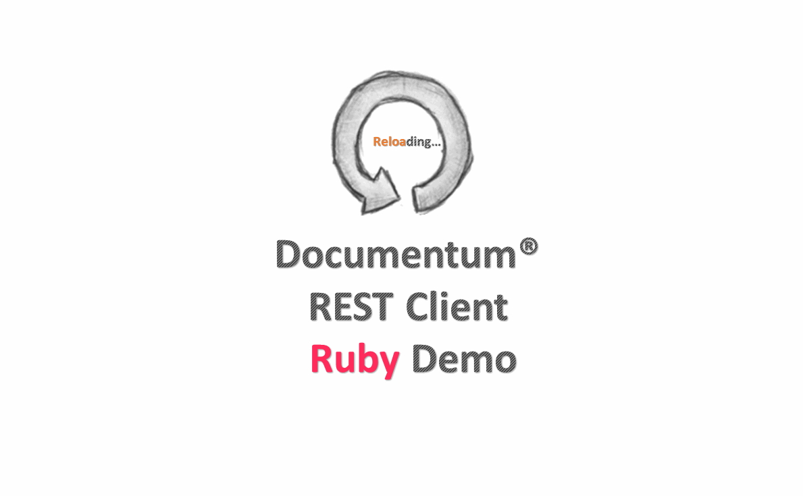

# documentum-rest-client-ruby
[](http://www.apache.org/licenses/LICENSE-2.0)

Reference implementation of a Ruby client for accessing Documentum REST Services

## What the demo demonstrates?
It will do the following jobs for some REST resources.
```
0. Get Users
1. Get Groups
2. Cabinet CRUD
3. SysObject CRUD
4. Simple Search
5. DQL 
6. Get BatchCapabilities
7. Get Checked Out Objects
8. Get Formats
```

## Requirements
```
1. Ruby2.1.5+ suggested, earlier Ruby versions such as 1.8.7, 1.9.2, and 1.9.3 are no longer supported officially. Version 2.1.5 is used in this demo.
2. Rails, a full stack framework for web application development. Version 4.2.3 is used in this demo.
3. An instance of *Documentum REST Services 7.2* is available.
```

## Instructions  
These following steps will direct you to how to run this demo from the scratch, including preparing the Ruby environment, building this project and starting the demo.
*Note*: below instructions are implemented only on Linux, and this demo has been tested on Ubuntu 14.04 when writing this document. 

1. Install some dependencies for Ruby

    ```
    sudo apt-get update
    sudo apt-get install git-core curl zlib1g-dev build-essential libssl-dev libreadline-dev libyaml-dev libsqlite3-dev sqlite3 libxml2-dev libxslt1-dev libcurl4-openssl-dev python-software-properties libffi-dev
    ```
    
2. Download and install [Ruby](https://www.ruby-lang.org/en/downloads/) from source code with make tool.

    ```
    cd ruby-2.1.5
    ./configure
    make
    sudo make install
    ```
     
3. Install rails framework

    ```
    sudo gem install bundler
    sudo gem install rails -v 4.2.3
    ```
    
4. Navigate to the project home directory.

    ```
    cd documentum-rest-client-ruby 
    ```
    
5. Build the project, which would generates a file named *dctmclient-0.1.0.gem* locally.

    ```
    gem build dctmclient.gemspec
    ```
    
6. Install the generated gem into local lib.

    ```
    sudo gem install dctmclient-0.1.0.gem
    ```
     
7. Navigate to the demo/ruby-client-sample directory under this project.

    ```
    cd demo/ruby-client-sample
    ```
    
8. Specify the *dctmclient* gem path in the *Gemfile* like below under ruby-client-sample directory.

    ```
    gem 'dctmclient', '0.1.0', :path => '/usr/local/lib/ruby/gems/2.1.0/gems/dctmclient-0.1.0'
    ```
    
9. Start the sample application.

    ```
    sudo bundle update
    sudo bundle install
    rails s -b 0.0.0.0
    ```
    
10. Access *http://localhost:3000/home*

##Demo


